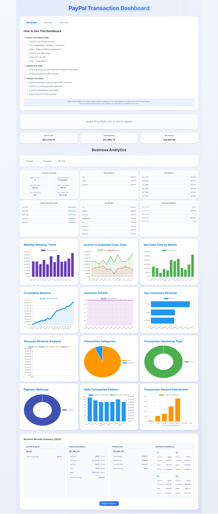

# PPalytics - Un-Official PayPal Analytics Dashboard

<div align="center">
  <a href="http://jkandre.science/projects/paypal-dashboard">
    
  </a>

<p align="center">
    A powerful, browser-based analytics tool for PayPal transaction data
    <br />
    <a href="https://jandreanalytics.github.io/PPalytics/"><strong>Live Demo »</strong></a>
    <br />
    <br />
    <a href="https://github.com/jandreanalytics/PPalytics/issues">Report Bug</a>
    ·
    <a href="https://github.com/jandreanalytics/PPalytics/issues">Request Feature</a>
  </p>
</div>

## About

PPalytics is a client-side web application that transforms your PayPal transaction data into actionable business insights. Originally built as a personal tool, it evolved into a comprehensive analytics platform that processes data entirely in your browser - ensuring complete privacy and security.

## Features

- 📊 **12 Interactive Visualizations**

  - Income vs expenses trends
  - Customer growth patterns
  - Seasonal analysis
  - Transaction distributions
- 🔄 **Smart Transaction Processing**

  - Automatic business detection
  - Recurring payment identification
  - Multi-currency support
  - Customer retention tracking
- 💰 **Tax Preparation Tools**

  - Quarterly breakdowns
  - Category sorting
  - Expense tracking
  - Excel report generation
- 🔒 **Privacy First**

  - 100% client-side processing
  - No data storage
  - Works offline
  - Zero server uploads

## Getting Started

1. Visit [PPalytics Dashboard](https://jkandre.science/projects/paypal-dashboard)
2. Export your PayPal data:
   ```
   PayPal.com -> Activity -> Statements -> Download
   Select "Balance affecting payments"
   Choose CSV format
   ```
3. Drop the CSV file into the dashboard
4. Start exploring your insights

## Local Development

1. Clone the repository
   ```sh
   git clone https://github.com/jandreanalytics/paypal-transaction-dashboard.git
   ```
2. Open index.html in your browser

<p align="right">(<a href="#readme-top">back to top</a>)</p>

## Development Story

This project showcases several key technical achievements:

### Smart Transaction Categorization

- Machine learning-inspired pattern matching system
- Vendor name normalization to handle variations in PayPal transaction descriptions
- Automatic business expense detection using comprehensive keyword database
- Custom categorization rules based on transaction patterns

### Data Processing

- Complex CSV parsing with support for multiple PayPal export formats
- Handling of currency conversions and international transactions
- Intelligent recurring payment detection
- Multi-currency transaction normalization

### Financial Analytics

- Customizable date range analysis
- Customer retention metrics including:
  - Customer lifetime value
  - Churn rate calculation
  - Loyalty tracking
  - Return customer analysis
- Business performance indicators:
  - Seasonal trends
  - Daily transaction patterns
  - Peak business hours
  - Revenue growth tracking

### Tax Preparation Features

- Quarterly performance breakdowns
- Business expense categorization
- Income source analysis
- Customizable Excel report generation
- Year-over-year comparisons

### Technical Implementation

#### Performance Optimizations

- Efficient data structures for large transaction sets
- Lazy loading of visualization components
- Optimized chart rendering for smooth interactions
- Client-side caching for faster re-renders

#### Security Considerations

- No server-side processing required
- All data stays in the browser
- No external API dependencies
- Works offline after initial load
- No data persistence between sessions

#### Visualization Engine

- Dynamic chart generation using Chart.js
- Responsive design adaptation
- Interactive data exploration
- Real-time filtering and updates

#### Data Export Capabilities

- Multiple export formats
- Customizable report templates
- Tax-ready summaries
- Transaction audit trails

## Usage Examples

### Business Analysis

```javascript
// Example of how the transaction categorization works
const transaction = {
    name: "Adobe Creative Cloud",
    type: "Subscription Payment",
    amount: -52.99
};

const category = detectCategory(transaction.name, transaction.type);
// Returns: "subscription"
```

### Transaction Pattern Detection

```javascript
// Example of recurring payment detection
const transactions = [
    { name: "Netflix", amount: -15.99, date: "2023-01-01" },
    { name: "Netflix", amount: -15.99, date: "2023-02-01" },
    { name: "Netflix", amount: -15.99, date: "2023-03-01" }
];

const pattern = detectFrequency(transactions);
// Returns: "Monthly"
```

### Report Generation

```javascript
// Example of tax report generation
const yearlyData = {
    income: 50000,
    expenses: 15000,
    categories: {
        "Software": 5000,
        "Services": 10000
    }
};

generateTaxReport(yearlyData);
// Generates detailed Excel report with categorized expenses
```

<p align="right">(<a href="#readme-top">back to top</a>)</p>

## License

Distributed under the MIT License. See `LICENSE.txt` for more information.

## Contact

Jeremy Andre - jeremy@jkandre.science

Portfolio: [jkandre.science](https://jkandre.science)

Project Link: [https://github.com/jandreanalytics/paypal-transaction-dashboard](https://github.com/jandreanalytics/paypal-transaction-dashboard)

<p align="right">(<a href="#readme-top">back to top</a>)</p>

<!-- MARKDOWN LINKS & IMAGES -->

`````

`````

[contributors-shield]: https://img.shields.io/github/contributors/jandreanalytics/PPalytics.svg?style=for-the-badge
[contributors-url]: https://github.com/jandreanalytics/PPalytics/graphs/contributors
[license-shield]: https://img.shields.io/github/license/jandreanalytics/PPalytics.svg?style=for-the-badge
[license-url]: https://github.com/jandreanalytics/PPalytics/blob/master/LICENSE.txt
[linkedin-shield]: https://img.shields.io/badge/-LinkedIn-black.svg?style=for-the-badge&logo=linkedin&colorB=555
[linkedin-url]: https://www.linkedin.com/in/jeremy-andre-a18925241/
